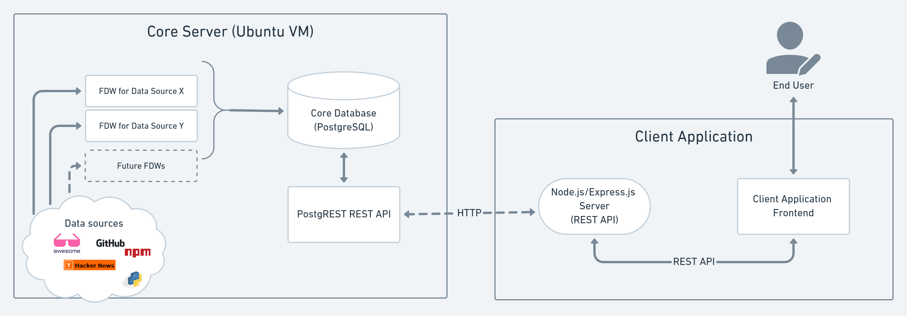
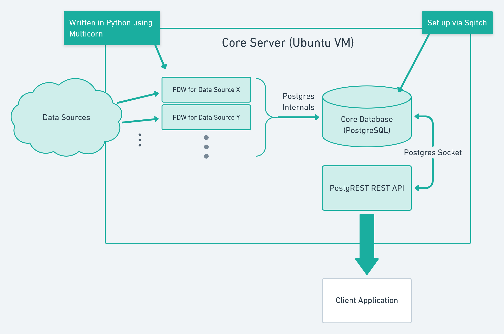

# AwesomeWiki Developer Guide

This repository contains two major software components that power AwesomeWiki. The first is [**AwesomeWiki Core,**](#awesomewiki-core) which is the database and API that provide AwesomeWiki's primary functionality. The second is [**AwesomeWiki MVP 1,**](#awesomewiki-mvp-1) (or "client application") which is a demo application built on top of AwesomeWiki Core, to showcase how developers can use AwesomeWiki to build their own applications.

You can see the two primary components above, and how they interface over a REST API. A REST API is also used _within_ the client application for the frontend to communicate with the client's Express server. This isn't strictly necessary in our example, but it's implemented here since most developers will consume AwesomeWiki's Core API from a midpoint server, and not directly from their users' browsers.

## AwesomeWiki Core

### Foreign Data Wrappers

The most important component in AwesomeWiki Core is the set of Foreign Data Wrappers (or FDWs) that provide data to the Postgres schema. In order to extend AwesomeWiki to include a new data source, you will need to write a new FDW.

Foreign Data Wrappers surface external data as virtual "tables" within a PostgreSQL database. No data is actually stored in Postgres, but when a user issues an SQL query, the data is fetched from an FDW in realtime. We use a Python library called [Multicorn](https://multicorn.org/) to implement our FDWs, but they can be implemented in other languages as well (with more effort).

We currently have the following FDWs implemented. You can find these in `fdws/awesome/*.py`:

-   `alist` - Two FDWs that parse Awesome Lists into top level categories and individual libraries
-   `articles` - Fetches articles for a language and library from Hacker News archives
-   `constant` - An example FDW that provides constant values
-   `python` - Fetched specific metadata about a python package from an Awesome List

These FDWs support the domain of our example application, but AwesomeWiki can be extended to support any domain by creating different FDWs that pull from different data sources.

### Designing an FDW for AwesomeWiki

In order to create a functional FDW that integrates with AwesomeWiki, you'll need to complete the following major steps. You can reference existing FDWs in the application to see concrete examples.

1. **Create a Python file that implements your FDW.**
    - Follow the examples in `fdws/awesome` to create your FDW. At bare minimum, your class will need to extend `multicorn.ForeignDataWrapper` and will need to implement the `execute` method.
    - If you create a new package for your FDWs (other than `awesome`) make sure to add that package to `setup.py` and install it before using your FDW.
    - Make sure to add each FDW to `__init__.py` in your package so it can be located and imported by Multicorn later.
2. **Create an Sqitch migration that creates your FDW in the Postgres server.**
    - You can use `sqitch add [name]` to create a new migration. In `db/deploy/[name].sql`, you'll need to create a few SQL statements.
        - `CREATE SERVER` to create a new foreign server representing your FDW
        - One or more `CREATE FOREIGN TABLE` statements referencing your server, to create the schema for the tables that your FDW serves
        - You'll need to `GRANT` permissions on your new foreign table to `web_anon` for it to be queryable from the PostgREST API later.
    - Additionally, you should create tests in `db/verify/[name].sql` for your new FDW. These tests will run when `sqitch verify` is run against the database plan, and can be used to verify that your FDW operates correctly without interacting with the REST API.
    - Don't forget to write code to rollback this migration in `db/revert/[name].sql`
    - Reference existing migrations in `db/` for more concrete examples.
3. **Add syntactic sugar for API endpoints in NGINX.**
    - Since [PostgREST follows a very specific path pattern for its API](http://postgrest.org/en/v7.0.0/api.html), you'll likely want to implement API endpoints on the Core server that follow more conventional API paths. You can do this using rewrite rules in NGINX.
    - Edit the NGINX site within `ansible/setup-nginx/sites-available` to add your rewrite rules. You can reference existing rewrite rules here for examples.
4. **Redeploy changes to application.**
    - Implementing a new FDW creates changes across the entire Core application stack. You should re-run the Ansible playbook (see the Installation Guide) in sync your current deployment to your latest changes.

## AwesomeWiki MVP 1

-   overview of use case and design decisions (why a separate server?)
-   component by component breakdown
