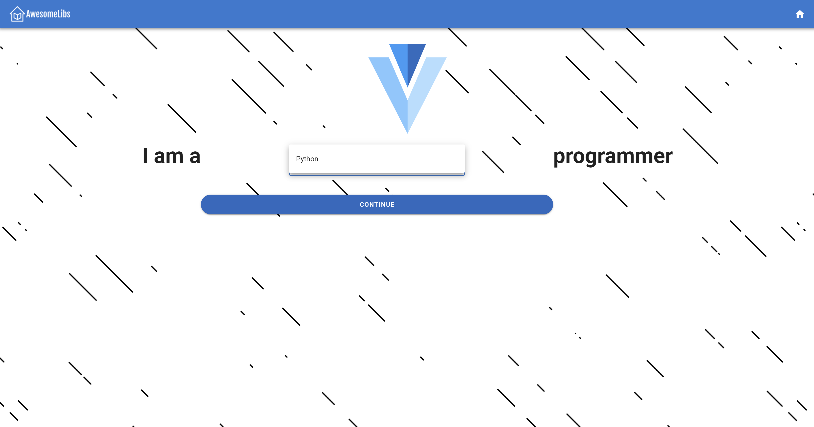
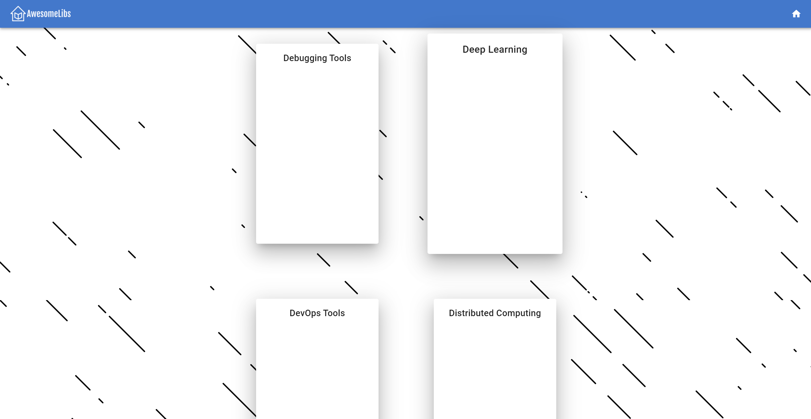
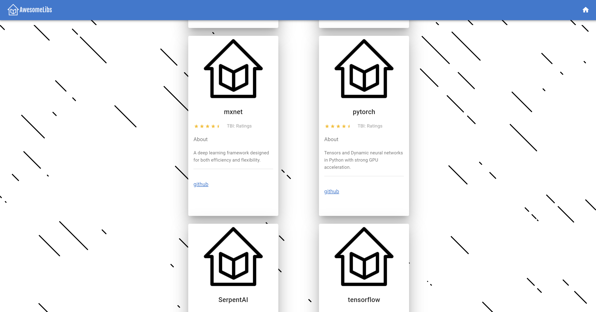
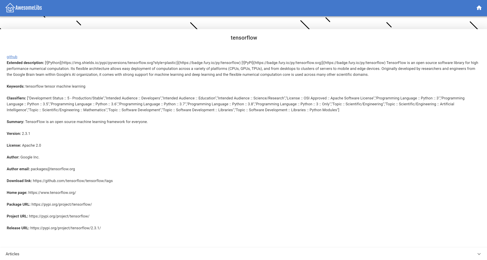
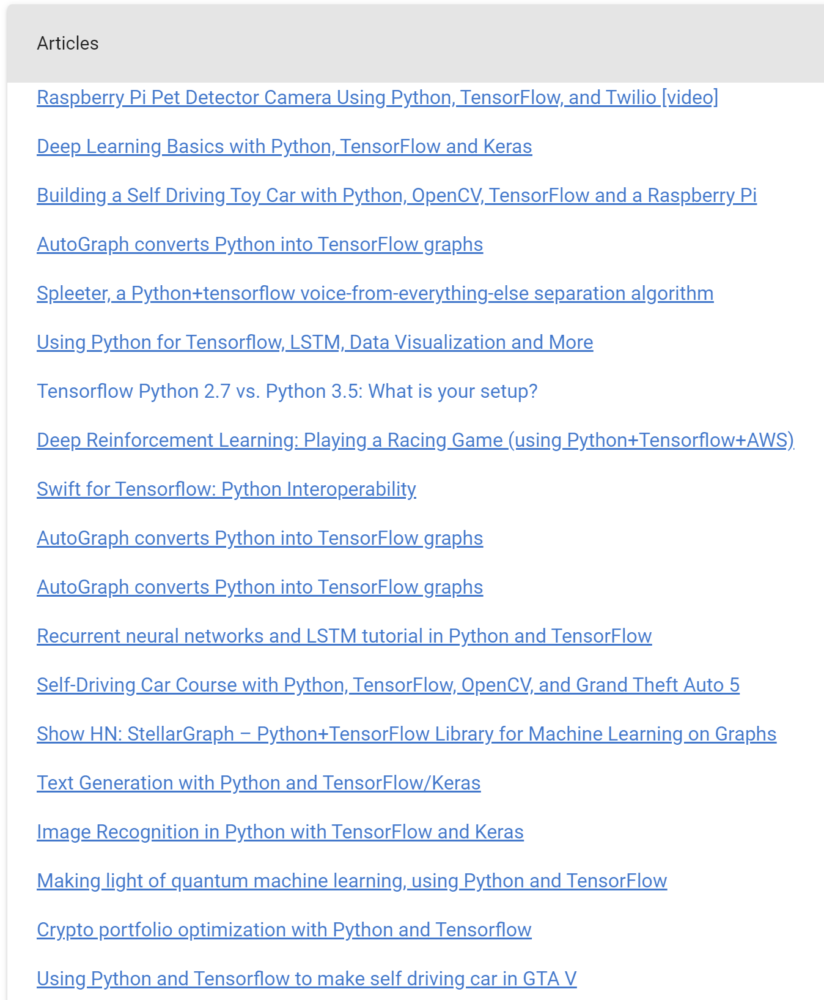

# AwesomeWiki User Guide

This guide shows how to use **AwesomeWiki Core** for users who wish to create their own applications that utilize **AwesomeWiki** services.
Topics discussed in this guide include:

-   Use cases
-   Demo client application usability information
-   AwesomeWiki API

## Use Cases

The goal of AwesomeWiki was to provide aggregation services to Awesome List content while still retaining the ability to have community curation.
Currently, AwesomeWiki is limited to only gathering data on software libraries for Python and Javascript. Some example use cases for this data include:

-   Filtering software libraries based on a particular problem that a user would like to solve
-   Aggregating tutorials on a given software library

## Demo Client Application

Our demo client application served as a proof of concept of how feasible the real-time web scraping capabilities of AwesomeWiki core would be and how
useful the information it gathered could be. The client application is a simple Node/Express/Vue application that uses AwesomeWiki core as a
web API and then organizes the data that it accesses in a way that is readable.

## API

AwesomeWiki core provides several API endpoints for getting information about supported languages, library categories, libraries, library details and tutorials/articles.

<table>
    <tr>
        <th>
            Path
        </th>
        <th>
            Description
        </th>
        <th>
            Example Response
        </th>
    </tr>
    <tr>
        <td>
            <code>/languages</code>
        </td>
        <td>
            Returns the list of languages supported.
        </td>
        <td>
            <pre lang="json">
[
    {
    "name": "JavaScript",
    "slug": "javascript"
    },
    {
    "name": "Python",
    "slug": "python"
    },
    {  },
]
            </pre>
        </td>
    </tr>
    <tr>
        <td>
            <code>/:lang/categories</code>
        </td>
        <td>
            Returns the categories for a language, identified by that language’s slug.
        </td>
        <td>
            <pre lang="json">
[
    {
    "name": "Admin Panels",
    "slug": "admin-panels"
    },
    {
    "name": "Audio",
    "slug": "audio"
    },
    {  },
]
            </pre>
        </td>
    </tr>
    <tr>
        <td>
            <code>/:lang/:cat</code>
        </td>
        <td>
            Returns the libraries for a particular language and category, identified by their slugs.
        </td>
        <td>
            <pre lang="json">
[
    {
    "name": "Pandas",
    "fqn": "pandas",
    "url": "pandas.pydata.org"
    },
    {  },
]
            </pre>
        </td>
    </tr>
    <tr>
        <td>
            <code>/:lang/:fqn</code>
        </td>
        <td>
            Returns the information about a single library, based on it’s Fully Qualified Name (FQN). Note that the info field will contain different metadata for every library.
        </td>
        <td>
            <pre lang="json">
{
    "name": "Pandas",
    "fqn": "pandas",
    "url": "pandas.pydata.org",
    "info": {  }
}
            </pre>
        </td>
    </tr>
    <tr>
        <td>
            <code>/:lang/:fqn/articles</code>
        </td>
        <td>
            Returns a list of articles for a library based on it’s Fully Qualified Name (FQN).
        </td>
        <td>
            <pre lang="json">
[
    {
    "title": "A Gentle Visual Intro to
                Data Analysis in Python Using Pandas",
    "url": "https://jalammar.github.io/
            gentle-visual-intro-to-data-analysis-python-pandas/"
    },
    {  },
]
            </pre>
        </td>
    </tr>
</table>
